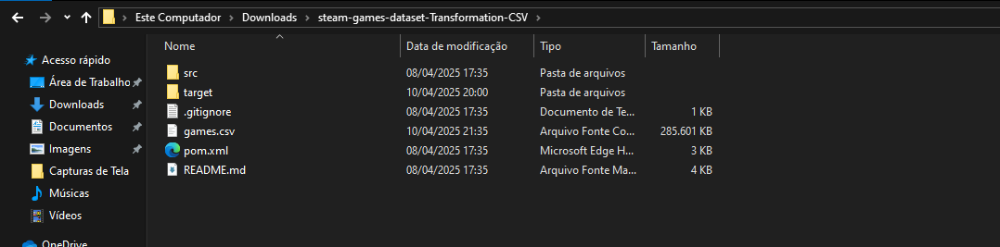
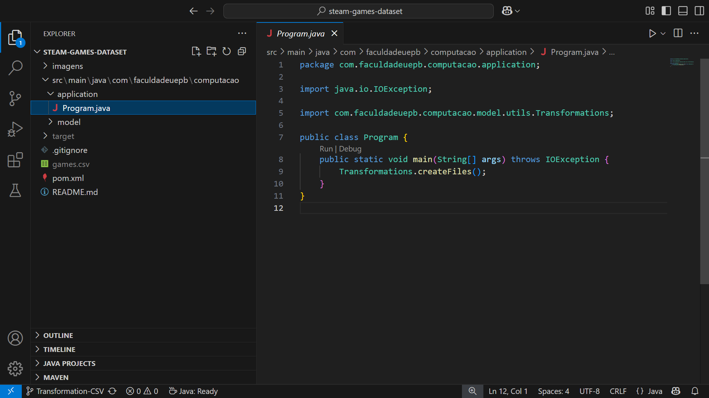
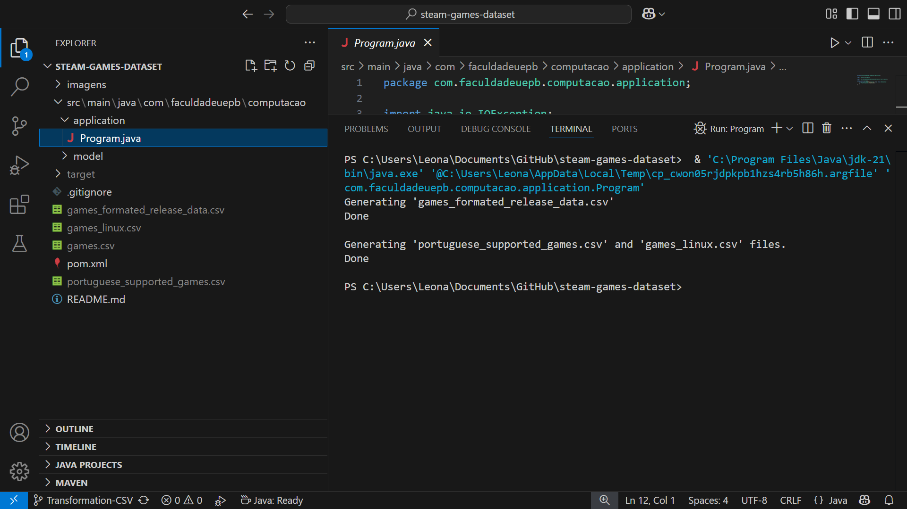

# 🎮 Steam Games Dataset

## 📋 Sumário  
- [🎯 Descrição](#-descrição)  
- [📦 Pré-requisitos](#-pré-requisitos) 
- [🛠️ Preparando o Ambiente](#-preparando-o-ambiente)  
  - [💻 Windows](#-windows)  
  - [🐧 Linux](#-linux)
  - [🍎 MacOS](#-macos)
- [🚀 Instruções de Uso](#-instruções-de-uso)
- [👥 Equipe Envolvida](#-equipe-envolvida)

---

## 🎯 Descrição
Este projeto tem como objetivo estudar o desempenho dos algoritmos de ordenação utilizando dados reais do [Steam Games Dataset](https://www.kaggle.com/datasets/fronkongames/steam-games-dataset) obtido no Kaggle. 

### 🔍 Objetivo Principal (Primeira Etapa):
Realizar transformações nos dados brutos, para garantintir que estejam no formato adequado para o processamento.

### ✅ Atividades Realizadas (Primeira Etapa):

Utilização do arquivo "games.csv" para as seguintes transformações:

- 📅 Conversão das datas de lançamento (campo "Release date") para o formato "DD/MM/AAAA".  
  - Arquivo gerado: "games_formated_release_data.csv"

- 🐧 Filtragem dos jogos compatíveis com Linux (campo "Linux"), a partir do arquivo anterior.  
  - Arquivo gerado: "games_linux.csv"

- 🌍 Filtragem dos jogos com suporte ao idioma português (campo "Supported languages"), a partir do mesmo arquivo.  
  - Arquivo gerado: "portuguese_supported_games.csv"

---

## 📦 Pré-Requisitos
- Apache Maven versão 3.8.7 ou superior;
- Java versão 21.0.6 ou superior.


## 🛠️ Preparando o Ambiente

### 💻 Windows

#### 1. Instalando o JDK
-  Baixe e instale a versão 21.0.6+ do JDK no [site da Oracle](https://www.oracle.com/br/java/technologies/downloads/#jdk23-windows)

#### 2. Configurando o Visual Studio Code
- Instale o [Visual Studio Code](https://code.visualstudio.com/docs/setup/windows)  
- Adicione o ["Extension Pack for Java"](https://marketplace.visualstudio.com/items?itemName=vscjava.vscode-java-pack)

💡 **Observação:** Este pacote já inclui o Apache Maven, dispensando o passo 3 se usar o Visual Studio Code.

#### 3. Instalando o Apache Maven
 - Baixe o [Apache Maven](https://maven.apache.org/download.cgi)  
  - Siga o [tutorial de instalação](https://maven.apache.org/install.html)
   - Se preferir, siga o [tutorial de instalação detalhado](https://charlesmms.azurewebsites.net/2017/09/04/instalando-maven-no-windows-10/).

---

### 🐧 Linux
📌 **Foco no Ubuntu**: As instruções abaixo são específicas para a distribuição Ubuntu. Se você utiliza outra distribuição Linux:
- Consulte a documentação oficial do seu sistema
- Adapte os comandos conforme necessário
- Pesquise por guias específicos para sua distro (Arch, Fedora, etc)

 **Dica**: A maioria dos comandos pode ser adaptada trocando o gerenciador de pacotes (ex: `apt` → `dnf` para Fedora)

#### 1. Instalando o JDK
- Tutorial: [Como instalar o JDK no Ubuntu](https://www.hostinger.com.br/tutoriais/como-instalar-java-no-ubuntu)

#### 2. Configurando o VS Code
 - Instale o [VS Code para Linux](https://code.visualstudio.com/docs/setup/linux)  
- Adicione o ["Extension Pack for Java"](https://marketplace.visualstudio.com/items?itemName=vscjava.vscode-java-pack)

💡 **Observação:** Este pacote já inclui o Apache Maven, dispensando o passo 3 se usar o Visual o Studio Code.

#### 3. Instalando o Apache Maven
 Tutorial: [Instalar Apache Maven no Ubuntu](https://www.hostinger.com.br/tutoriais/install-maven-ubuntu)


---

### 🍎 MacOS

#### 1. Instalando o JDK
-  Baixe o JDK 21.0.6+ na [ Oracle](https://www.oracle.com/br/java/technologies/downloads/#jdk23-mac)

#### 2. Configurando o VS Code
- Instale o [VS Code para Mac](https://code.visualstudio.com/docs/setup/mac)  
- Adicione o ["Extension Pack for Java"](https://marketplace.visualstudio.com/items?itemName=vscjava.vscode-java-pack)

💡 **Observação:** Este pacote já inclui o Apache Maven, dispensando o passo 3 se usar o Visual Studio Code.

#### 3. Instalando o Apache Maven
- Siga o [tutorial para MacOS](https://www.digitalocean.com/community/tutorials/install-maven-mac-os)

---


## 🚀 Instruções de Uso

Após instalar o Java (JDK), o Apache Maven e o Visual Studio Code, podemos, de fato, prosseguir para a execução do programa desenvolvido.

1. Clone o repositório:  
   ```bash
   git clone https://github.com/davrzin/steam-games-dataset.git
   ````

2. Ou baixe como .zip e descompacte.

3. Baixe o aquivo  "games.csv" na página Steam Games Dataset da plataforma [Kaggle](https://www.kaggle.com/datasets/fronkongames/steam-games-dataset).

4. Descompacte o arquivo "games.csv.zip" e coloque o "games.csv" no diretório principal do projeto.

    **Exemplo (Windows):**
    


4. Abra o projeto no Visual Studio Code (ou na IDE de sua preferência) e execute a classe "Program.java".

    **Antes da execução:**
    

    **Depois da execução:**
    

📁 Os arquivos gerados (``games_formated_release_data.csv``, ``portuguese_supported_games.csv`` e ``games_linux.csv``) serão salvos no mesmo diretório de ``games.csv``.


## 👥 Equipe Envolvida

<table>
  <tr>
    <td align="center">
      <a href="https://github.com/ArturOliveir4">
        <br />
        <sub><b>Artur Oliveira</b></sub>
      </a><br />
    </td>
    <td align="center">
      <a href="https://github.com/davrzin">
        <br />
        <sub><b>Davi Roberto</b></sub>
      </a><br />
    </td>
    <td align="center">
      <a href="https://github.com/leonardo-istamilo">
        <br />
        <sub><b>Leonardo Istamilo</b></sub>
      </a><br />
    </td>
  </tr>
</table>
