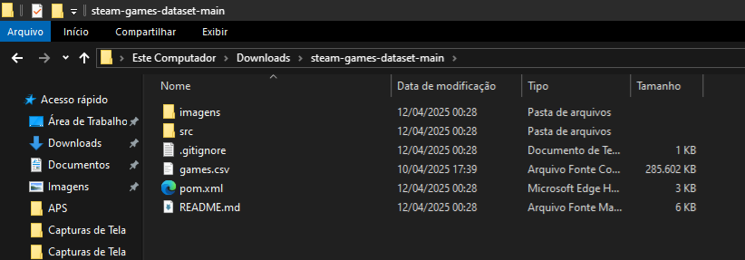
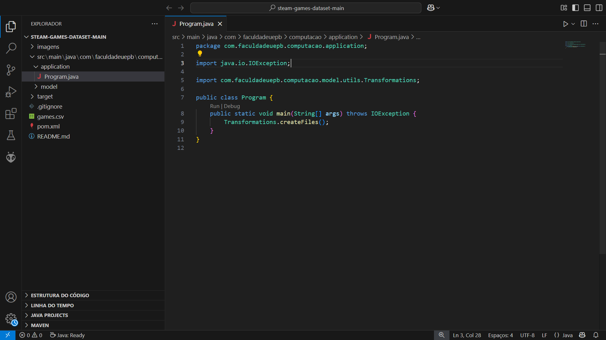

# Steam-Games-Dataset

## **Sumário**  
- [Descrição](#descrição)  
- [Pré-requisitos](#pré-requisitos) 
- [Preparando o Ambiente](#preparando-o-ambiente)  
  - [Windows](#Windows)  
  - [Linux](#Linux)
  - [Mac OS](#Mac-OS)
- [Instruções de Uso](#instruções-de-uso)

- [Equipe Envolvida](#equipe-envolvida)s

## Descrição
Este projeto tem como objetivo estudar o desempenho dos algoritmos de ordenação utilizando dados reais do "Steam Games Dataset" obtido no [Kaggle](https://www.kaggle.com/datasets/fronkongames/steam-games-dataset). Para isso, é necessário realizar algumas transformações nos dados brutos, garantindo que estejam no formato adequado para processamento.

Nesta primeira etapa do projeto, o foco está na preparação do dataset e na realização de transformações nos dados extraídos do Kaggle. O objetivo é organizar e adaptar os dados para que possam ser processados pelos algoritmos de ordenação.

### Atividades Realizadas na primeira etapa:

Utilização do arquivo "games.csv" para as transformações.

- Conversão das datas de lançamento (campo Release date) para o formato DD/MM/AAAA.

    - Arquivo gerado: "games_formated_release_data.csv".

- Filtragem dos games compatíveis com Linux (campo Linux) a partir do arquivo gerado na primeira transformação (games_formated_release_data.csv).

    - Arquivo gerado: "games_linux.csv".

- Filtragem dos games que possuem suporte ao idioma português (campo Supported languages) a partir do arquivo gerado na primeira transformação (games_formated_release_data.csv).

    - Arquivo gerado: "portuguese_supported_games.csv".

*Em construção...*

## Pré-Requisitos
- Maven versão: 3.8.7
- Java versão: 21.0.6

*Em construção...*

## Preparando o Ambiente
### Windows
**1. Instalando o Java Development Kit (JDK):**

- Baixe e instale a versão 21.0.6, ou posterior, do JDK. no site da [Oracle ](https://www.oracle.com/br/java/technologies/downloads/#jdk21-windows).

**2. Instalando e configurando o Visual Studio Code:**

Instale o [Visual Studio Code](https://code.visualstudio.com/docs/setup/linux#_install-vs-code-on-linux) e adicione o package ["Extension Pack for Java"](https://marketplace.visualstudio.com/items?itemName=vscjava.vscode-java-pack). Esse package contém todos as extensões fundamentais para desenvolvimento na linguagem Java.

- OBS.: O packege"Extension Pack for Java", inclui uma versão do Apache Maven, tornando desnecessário o passo seguinte, se você for utilizar o Visual Studio Code, mas necessário se for utilizar outra IDE para executar o programa.

**3. Instalando o Apache Maven:**

- Baixe o "Binary zip archive" do Apache Maven no [site oficial](https://maven.apache.org/download.cgi). O site disponibiliza as [instruções de instalação](https://maven.apache.org/install.html), caso encontre dificuldades, recomendamos esse [tutorial](https://maven.apache.org/install.html).

### Linux

**1. Instalando o Java Development Kit (JDK):**

- [Como instalar o JDK no Ubuntu](https://www.hostinger.com.br/tutoriais/como-instalar-java-no-ubuntu) (testado)

**2. Instalando e configurando o Visual Studio Code:**

Instale o [Visual Studio Code](https://code.visualstudio.com/docs/setup/linux#_install-vs-code-on-linux) e adicione o package ["Extension Pack for Java"](https://marketplace.visualstudio.com/items?itemName=vscjava.vscode-java-pack). Esse package contém todos as extensões fundamentais para desenvolvimento na linguagem Java.

- OBS.: O packege"Extension Pack for Java", inclui uma versão do Apache Maven, tornando desnecessário o passo seguinte, se você for utilizar o Visual Studio Code, mas necessário se for utilizar outra IDE para executar o programa.

**3. Instalando O Apache Maven:**
- [Como instalar a Maven no Ubuntu](https://www.hostinger.com.br/tutoriais/install-maven-ubuntu)

*Em construção...*

### MacOS

**1. Instalando o Java Development Kit (JDK):**

- Baixe e instale a versão 21.0.6, ou posterior, do JDK. no site da [Oracle ](https://www.oracle.com/br/java/technologies/downloads/#jdk23-mac).

**2. Instalando e configurando o Visual Studio Code:**

Instale o [Visual Studio Code](https://code.visualstudio.com/docs/setup/linux#_install-vs-code-on-linux) e adicione o package ["Extension Pack for Java"](https://marketplace.visualstudio.com/items?itemName=vscjava.vscode-java-pack). Esse package contém todos as extensões fundamentais para desenvolvimento na linguagem Java.

- OBS.: O packege"Extension Pack for Java", inclui uma versão do Apache Maven, tornando desnecessário o passo seguinte, se você for utilizar o Visual Studio Code, mas necessário se for utilizar outra IDE para executar o programa.

**3. Instalando o Apache Maven:**

- Baixe o Apache Maven no  site: [https://maven.apache.org/download.cgi](https://maven.apache.org/download.cgi). O site disponibiliza as [instruções de instalação](https://maven.apache.org/install.html), mas caso necessite, recomendamos esse [tutorial](https://www.digitalocean.com/community/tutorials/install-maven-mac-os?_x_tr_hist=true).

## Instruções de Uso
Após instalar Java (JDK), Maven e o Visual Studio Code, podemos prosseguir, de fato, para a execução do sistema desenvolvido.

1. Clone este repositorio usando o URL `https://github.com/davrzin/steam-games-dataset.git` ou baixe como arquivo zip.

2. Após clonar ou baixar, descompacte o repositorio.

3. Baixe o aquivo  "games.csv" na página Steam Games Dataset da plataforma Kaggle. [Link](https://www.kaggle.com/datasets/fronkongames/steam-games-dataset)

4. Descompacte o arquivo "games.csv.zip" e cole no diretorio principal do repositorio baixado.

    Exemplo no Windows:
    

4. Por fim, abra o projeto no Visual Studio Code, ou IDE de sua escolha, e execute a classe "Program.Java".

    Exemplo de como deve estar antes na execução no  Visual Studio Code:
    

    Exemplo de como deve estar depois da execução no Visual Studio Code:
    

Os arquivos gerados "games_formated_release_data.csv", "portuguese_supported_games.csv" e "games_linux.csv" serão armazenados no mesmo diretório que "games.csv".

*Em construção...*

## Equipe Envolvida

*Em Construção...*